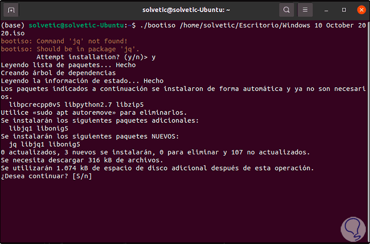
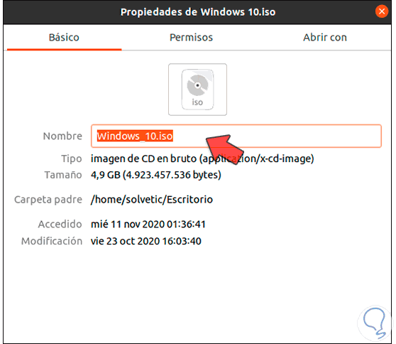
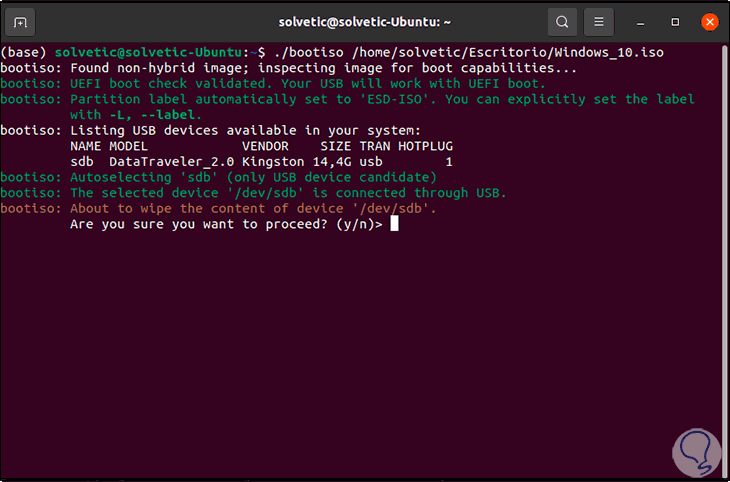
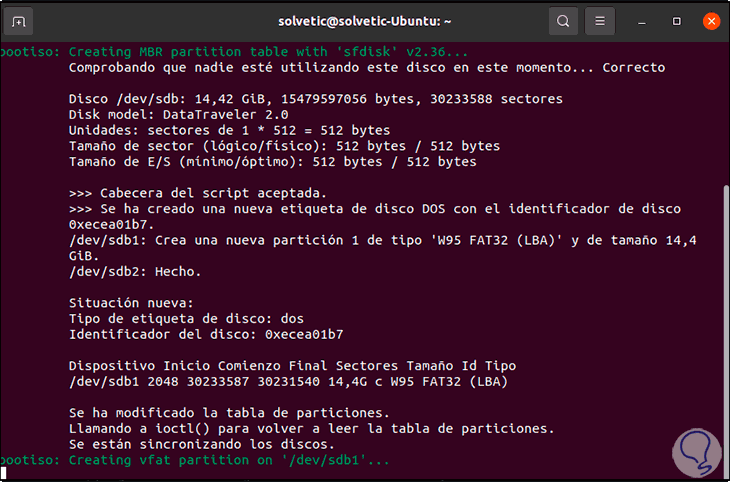
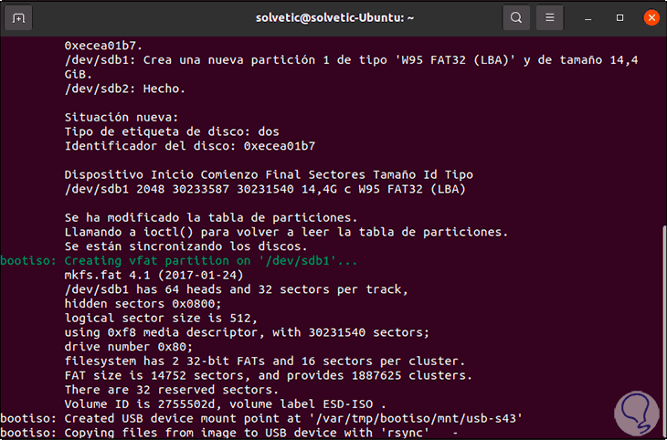

Script to create bootable Windows USB from Linux terminal
=========================================================

Step 1: download the iso image of the Windows or GNU Linux operating system.

Step 2: from Activities we open the Disks utility:


Step 3: there we are going to unmount the USB drive from the system: 


Step 4: once disassembled, we will see the following:


Step 5: we click on the pinion icon and in the displayed list we select "Format partition": 


Step 6: we assign a name to the drive and select the FAT format: 


Step 7: we click Next and we will see this message: 
        


Step 8: we apply the changes by clicking on "Format": 


Step 9: once the process is finished we will see the format applied correctly: 


Step 10: we mount the USB by clicking on the playback sign: 


Step 11: then we execute the command to run the script: 
 
 ```    
 sudo ./script.sh 
 ```

Step 12: once we have finished, we are ready to create the Windows bootable USB, for this we must use the following syntax:

```
# go to the root directory or home/user    
cd ~

# run the bootiso command, space path to the .iso file windows
./bootiso windows_image.iso
 ```

Step 13: press Enter and we must accept the download and installation of some add-ons:



Step 14: this will give an error because the ISO image contains spaces and we can lose our minds looking for the error, to correct it we simply go back to the properties and remove the spaces in the Windows 10 ISO name:



Step 15: when executing the command again with this change we can see that the USB is detected with its respective capacity and characteristics:



Step 16: there we enter the letter "y" to confirm the process and everything related to the creation of the Windows bootable USB will take place:



Then all the necessary files will be copied to the Windows USB, in this case the version of Windows used is version 10.



