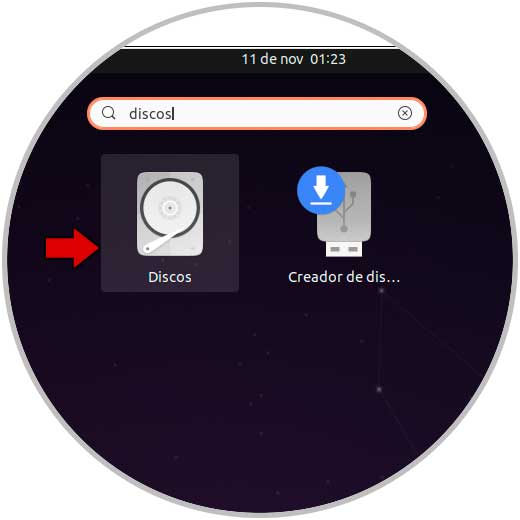

Script to create bootable Windows USB from Linux terminal
=========================================================

Step 1: download the iso image of the Windows or GNU Linux operating system.

Step 2: from Activities we open the Disks utility:

