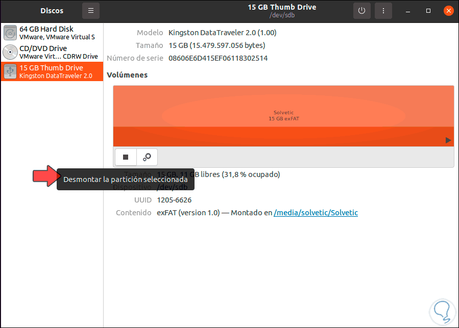
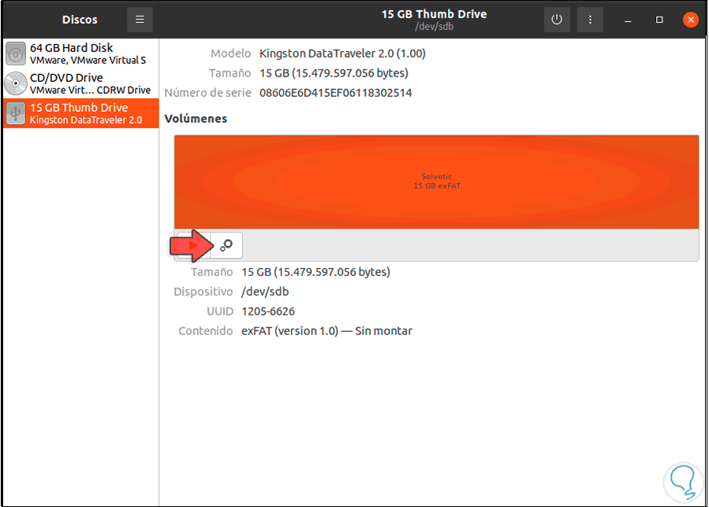
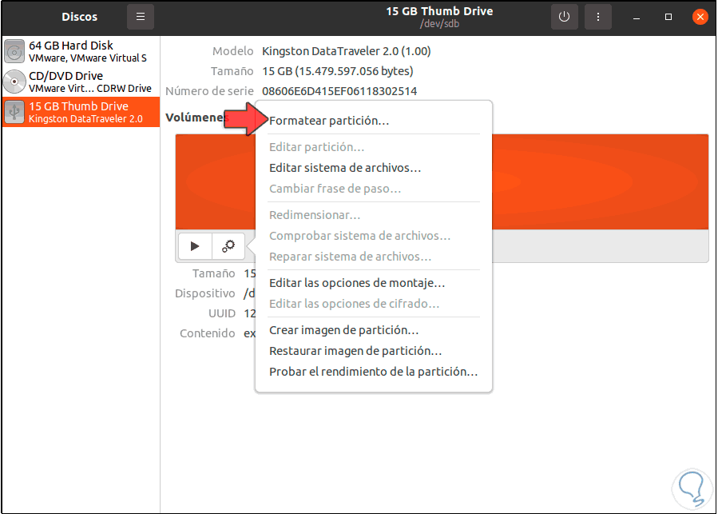
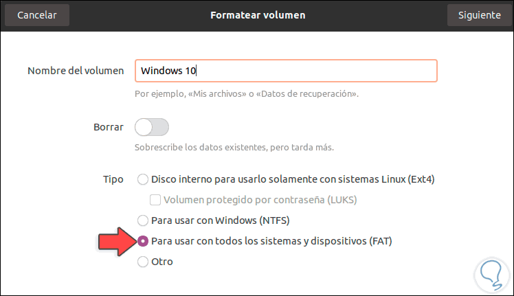
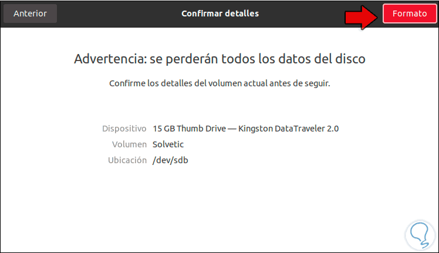
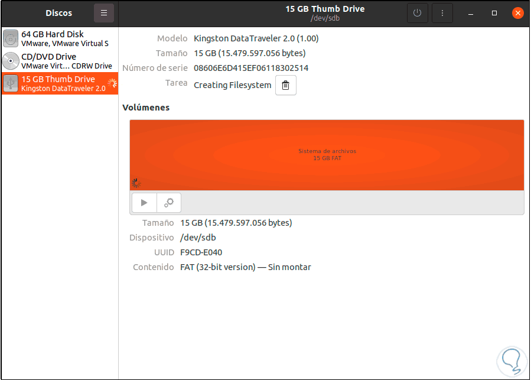
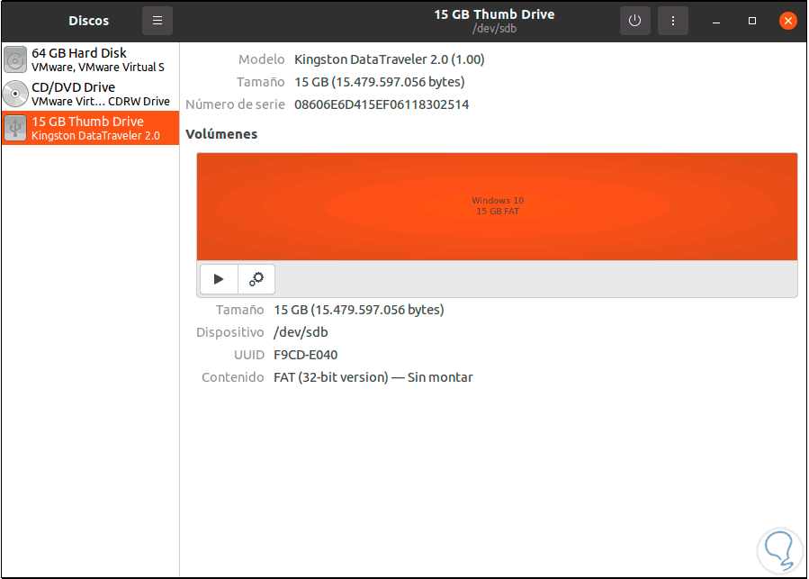
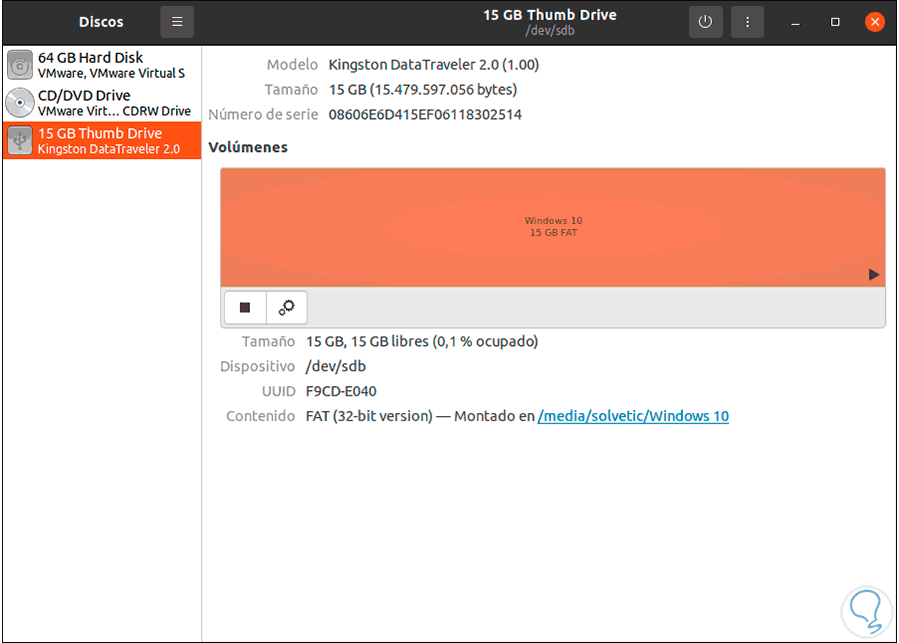

Script to create bootable Windows USB from Linux terminal
=========================================================

Step 1: download the iso image of the Windows or GNU Linux operating system.

Step 2: from Activities we open the Disks utility:


Step 3: there we are going to unmount the USB drive from the system: 



Step 4: once disassembled, we will see the following:



Step 5: we click on the pinion icon and in the displayed list we select "Format partition": 



Step 6: we assign a name to the drive and select the FAT format: 



Step 7: we click Next and we will see this message: 
        


Step 8: we apply the changes by clicking on "Format": 



Step 9: once the process is finished we will see the format applied correctly: 



Step 10: we mount the USB by clicking on the playback sign: 



Step 11: then we execute the command to run the script: 
 
 ```    
 sudo ./script.sh 
 ```

 